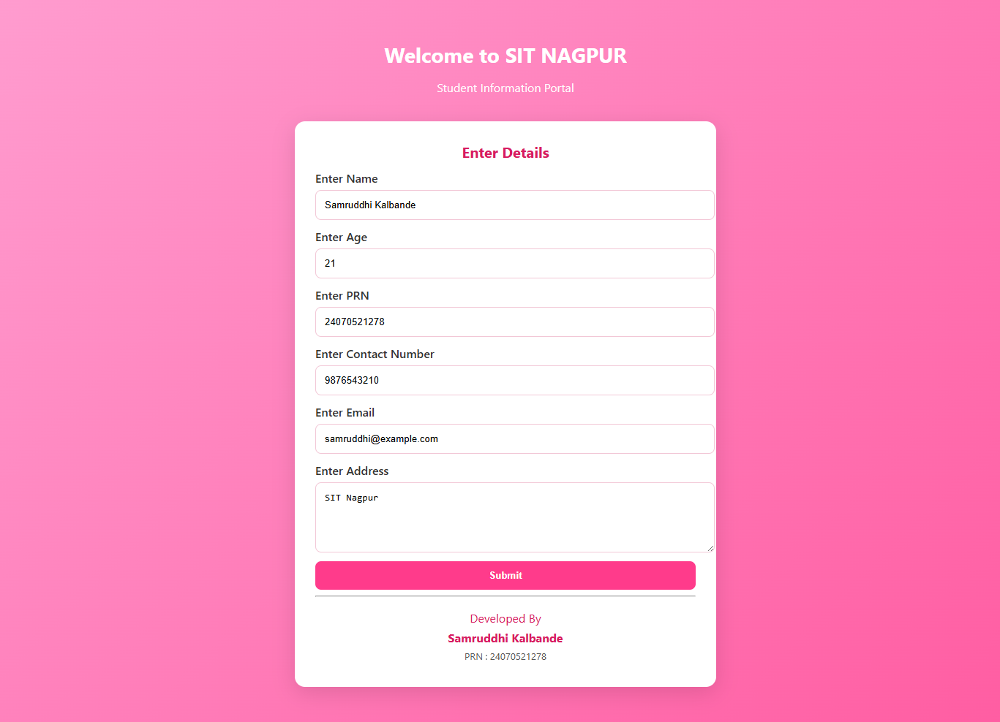
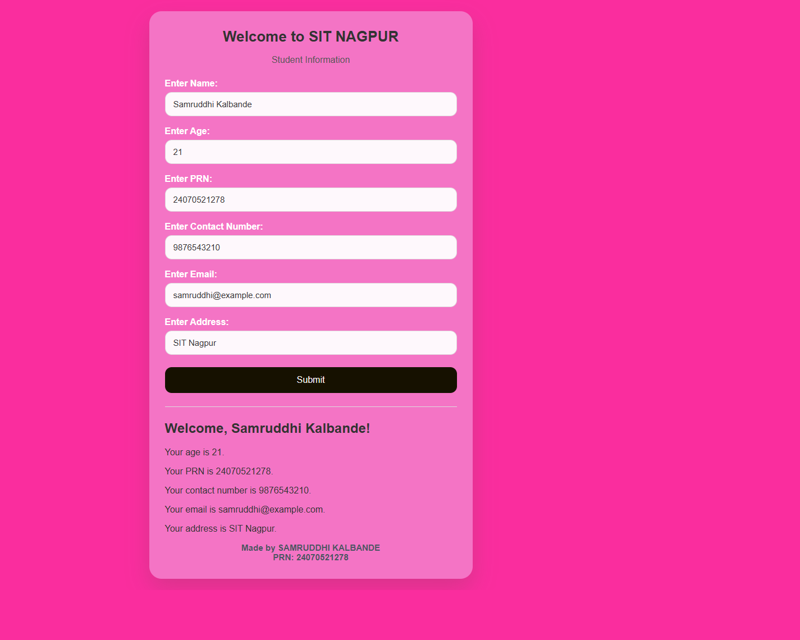

# Experiment No. 1

**Student Name:** Samruddhi Kalbande  
**PRN:** 24070521278  
**File Path:** `pract 1/PRACTICAL/index.html`, `pract 1/PRACTICAL/script.js`

---

## Experiment Title

**SIT NAGPUR | Student Registration (Student Information Portal)**

---

## Software / Tools Required

1. Visual Studio Code / Antigravity IDE
2. Google Chrome (or modern web browser)
3. HTML5
4. CSS3
5. JavaScript (ES6)

---

## Experiment Program Code

### Task 1.a — Student Information Form and Interface Setup

**File:** `pract 1/PRACTICAL/index.html`

The HTML document creates a centered, card-based interface containing input controls for student credentials (Name, Age, PRN, Contact Number, Email, and Address), a submission button, an internal script executing on page load, and author credits.

```html
<!doctype html>
<html lang="en">
<head>
  <meta charset="utf-8">
  <meta name="viewport" content="width=device-width,initial-scale=1">
  <title>Pract 1 - JS: inline, internal, external</title>
  <link rel="stylesheet" href="styles.css">
  <script>
    // Internal script: runs on load
    console.info('Internal script: page is loading');
    function internalWelcome() {
      const el = document.getElementById('internal-msg');
      el.textContent = 'Hello from the internal script!';
      console.log('internalWelcome called');
    }
  </script>
</head>
<body onload="internalWelcome()">
  <div class="page">
    <header class="hero">
      <h1>Welcome to SIT NAGPUR</h1>
      <p class="subtitle">Student Information Portal</p>
    </header>

    <main class="card">
      <h2 class="card-title">Enter Details</h2>
      <p id="internal-msg" style="display:none"></p>
      <form id="studentForm">
        <label class="field">Enter Name
          <input id="name" placeholder="Enter Name">
        </label>
        <label class="field">Enter Age
          <input id="age" type="number" placeholder="Enter Age">
        </label>
        <label class="field">Enter PRN
          <input id="prn" placeholder="Enter PRN">
        </label>
        <label class="field">Enter Contact Number
          <input id="contact" placeholder="Enter Contact Number">
        </label>
        <label class="field">Enter Email
          <input id="email" type="email" placeholder="Enter Email">
        </label>
        <label class="field">Enter Address
          <textarea id="address" placeholder="Enter Address"></textarea>
        </label>

        <button class="primary" id="submitStudent" type="button">Submit</button>
      </form>

      <hr>
      <div class="dev">
        <p>Developed By</p>
        <p class="dev-name">Samruddhi Kalbande</p>
        <p class="prn">PRN : 24070521278</p>
      </div>
    </main>
  </div>

  <script src="script.js"></script>
</body>
</html>
```

---

### Task 1.b — Event Handling, Console Logging & Template Literals

**File:** `pract 1/PRACTICAL/script.js`

The JavaScript script attaches an event listener to the form submission button, collects form values into a structured object, logs diagnostic outputs to the browser console (`console.log`, `console.warn`), and utilizes ES6 template literals for dynamic string formatting.

```javascript
// External script: attach handlers and use console methods
console.log('External script loaded');
console.warn('This demonstrates console.warn');

function inlineAlert(){
  alert('This was called from an inline onclick attribute');
}

// Safe handler attachment for optional elements
const showBtn = document.getElementById('showBtn');
if(showBtn){
  showBtn.addEventListener('click', function(){
    const name = document.getElementById('name').value || 'Guest';
    const greet = `Welcome, ${name}! Glad to see you.`; // template literal
    const gEl = document.getElementById('greet');
    if(gEl) gEl.textContent = greet;
    console.log('Greet displayed for', name);
  });
}

// Handle student form submit button
const submitStudent = document.getElementById('submitStudent');
if(submitStudent){
  submitStudent.addEventListener('click', function(){
    const name = document.getElementById('name').value || '';
    const age = document.getElementById('age').value || '';
    const prn = document.getElementById('prn').value || '';
    const contact = document.getElementById('contact').value || '';
    const email = document.getElementById('email').value || '';
    const address = document.getElementById('address').value || '';
    console.log('Student submitted:', {name,age,prn,contact,email,address});
    alert('Submitted: ' + (name || 'No name')); 
  });
}
```

---

## Output

1. **Internal Script Invocation:** Upon initial document load, the `<body>` element executes `onload="internalWelcome()"`, issuing diagnostic messages via `console.info()` and `console.log()`.
2. **Form Interaction:** The user enters their student profile details (Name, Age, PRN, Contact, Email, and Address).
3. **Form Submission & Feedback:** Clicking the **Submit** button triggers the external event listener, aggregates student data into an object, logs the payload to the developer console, and prompts the user with an interactive submission alert.

---

## Screenshot



---

## Case Study

### Case Study — Student Information Display Portal (Inline & Internal JS)

**File:** `pract 1/CASE STUDY/user-info.html`, `pract 1/CASE STUDY/function.js`

A dedicated student portal demonstrating inline event handling (`onclick`), internal `<script>` styling, and advanced console debugging methods (`console.table()`, `console.time()`, and `console.timeEnd()`).

```javascript
function greet() {
    alert("Welcome to SITNAGPUR!");

    console.table([
        {
            Name: "Sample User",
            Course: "JavaScript"
        }
    ]);

    console.time("Execution");
    console.timeEnd("Execution");
}
```

### Case Study Output

1. **Inline Function Execution:** Clicking the button directly invokes `greet()` via an inline `onclick` handler.
2. **Console Table Inspection:** Formats tabular data in developer tools via `console.table()` for streamlined object inspection.
3. **Execution Benchmarking:** Measures performance and execution duration using `console.time()` and `console.timeEnd()`.

### Case Study Screenshot



---

## Result / Conclusion

Experiment 1 was successfully implemented and verified. The experiment demonstrates foundational web development principles in JavaScript, including the differences between inline, internal, and external script integration, DOM element querying, event binding via `addEventListener()`, string interpolation using ES6 template literals, and browser debugging via console logging methods (`log`, `info`, `warn`, `table`, `time`).
