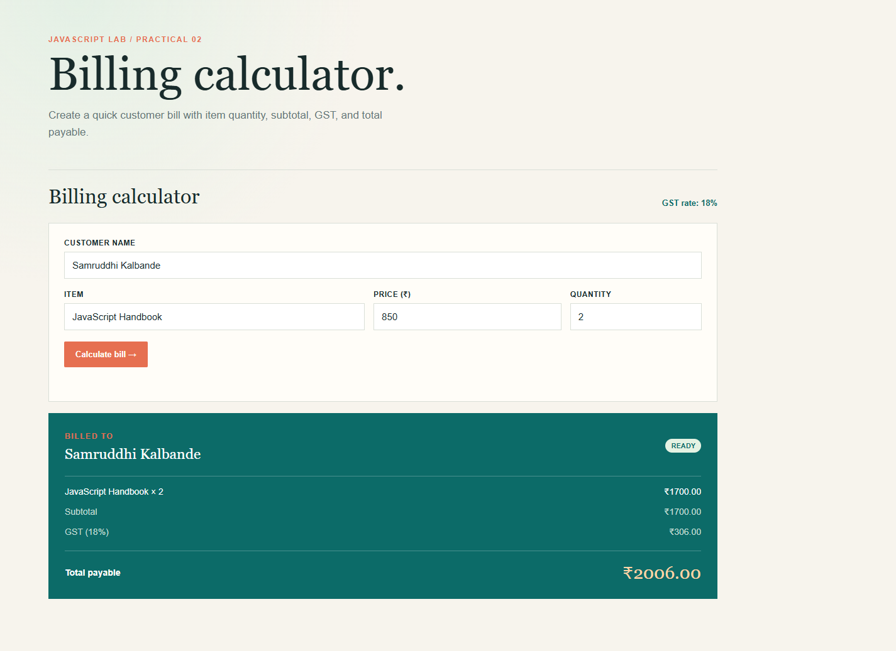
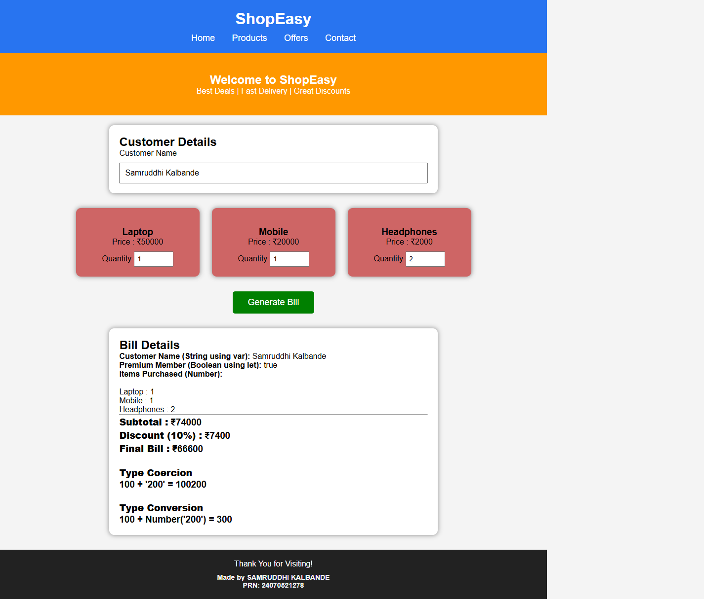

# Experiment No. 2

**Student Name:** Samruddhi Kalbande  
**PRN:** 24070521278  
**File Path:** `pract 2/PRACTICAL/index.html`, `pract 2/PRACTICAL/script.js`

---

## Experiment Title

**Online Shopping Bill Calculator & JavaScript Fundamentals**

---

## Software / Tools Required

1. Visual Studio Code / Antigravity IDE
2. Google Chrome (or modern web browser)
3. HTML5
4. CSS3
5. JavaScript (ES6)

---

## Experiment Program Code

### Task 2.a — Product Entry Interface and Output Receipt Layout

**File:** `pract 2/PRACTICAL/index.html`

The HTML document renders an online shopping bill calculator with inputs for Customer Name, Item Name, Unit Price (₹), and Quantity, an action button to compute total amounts, and a live receipt summary container.

```html
<!DOCTYPE html>
<html lang="en">
<head>
    <meta charset="UTF-8">
    <meta name="viewport" content="width=device-width, initial-scale=1.0">
    <title>Practical 2 | JavaScript Fundamentals</title>
    <link rel="stylesheet" href="style.css">
</head>
<body>
    <main class="page-shell">
        <header class="page-header">
            <p class="eyebrow">JavaScript Lab / Practical 02</p>
            <h1>Billing calculator.</h1>
            <p class="intro">Create a quick customer bill with item quantity, subtotal, GST, and total payable.</p>
        </header>

        <section class="billing-panel" aria-labelledby="billing-heading">
            <div class="section-heading">
                <div>
                    <h2 id="billing-heading">Billing calculator</h2>
                </div>
                <p class="tax-note">GST rate: 18%</p>
            </div>
            <form id="billingForm" class="billing-form">
                <div class="field"><label for="customerName">Customer name</label><input id="customerName" type="text" placeholder="e.g. Aditi Sharma" required></div>
                <div class="item-row">
                    <div class="field"><label for="itemName">Item</label><input id="itemName" type="text" placeholder="e.g. Notebook" required></div>
                    <div class="field"><label for="price">Price (₹)</label><input id="price" type="number" min="0" step="0.01" placeholder="0.00" required></div>
                    <div class="field"><label for="quantity">Quantity</label><input id="quantity" type="number" min="1" step="1" value="1" required></div>
                </div>
                <button class="primary-button" type="submit">Calculate bill <span aria-hidden="true">→</span></button>
                <p class="form-message" id="formMessage" role="alert"></p>
            </form>
            <div class="receipt" id="receipt" aria-live="polite" aria-label="Bill summary">
                <div class="receipt-placeholder">Your calculated bill will appear here.</div>
            </div>
        </section>
    </main>
    <script src="script.js"></script>
</body>
</html>
```

---

### Task 2.b — Numerical Parsing, GST Computation & Object Destructuring

**File:** `pract 2/PRACTICAL/script.js`

The JavaScript script handles form submission, performs rigorous type checking (`Number.isFinite`, `Number.isInteger`), computes subtotal, applies an 18% GST calculation, packages the transaction into an object, and extracts summary fields via destructuring.

```javascript
const taxRate = 0.18;

const formatCurrency = (amount) => `₹${amount.toFixed(2)}`;

document.getElementById("billingForm").addEventListener("submit", (event) => {
    event.preventDefault();

    const customerName = document.getElementById("customerName").value.trim();
    const itemName = document.getElementById("itemName").value.trim();
    const price = Number(document.getElementById("price").value);
    const quantity = Number(document.getElementById("quantity").value);
    const formMessage = document.getElementById("formMessage");

    if (!customerName || !itemName || price < 0 || quantity < 1 || !Number.isFinite(price) || !Number.isInteger(quantity)) {
        formMessage.textContent = "Enter a valid customer, item, price, and whole-number quantity.";
        return;
    }

    formMessage.textContent = "";
    const subtotal = price * quantity;
    const gst = subtotal * taxRate;
    const total = subtotal + gst;
    const bill = { customerName, itemName, price, quantity, subtotal, gst, total };
    const { customerName: billedTo, itemName: item, subtotal: billSubtotal, gst: billGst, total: billTotal } = bill;

    document.getElementById("receipt").innerHTML = `
        <div class="receipt-top"><div><span class="receipt-label">Billed to</span><strong>${billedTo}</strong></div><span class="paid-tag">Ready</span></div>
        <div class="receipt-line"><span>${item} × ${quantity}</span><span>${formatCurrency(price * quantity)}</span></div>
        <div class="receipt-line muted"><span>Subtotal</span><span>${formatCurrency(billSubtotal)}</span></div>
        <div class="receipt-line muted"><span>GST (18%)</span><span>${formatCurrency(billGst)}</span></div>
        <div class="receipt-total"><span>Total payable</span><strong>${formatCurrency(billTotal)}</strong></div>`;
});
```

---

## Output

1. **Initial Screen:** Renders a clean billing interface showing input fields for Customer Name, Item, Unit Price, and Quantity, with an informational badge stating `GST rate: 18%`.
2. **Validation Control:** Enforces presence of strings and positive numerical values before executing computations.
3. **Receipt Generation:** Renders a structured invoice card displaying Customer Name, Item × Quantity, Base Subtotal, 18% GST Amount, and Final Total Payable formatted using `.toFixed(2)`.

---

## Screenshot



---

## Case Study

### Case Study — ShopEasy E-Commerce Store (Variables, Types & Coercion)

**File:** `pract 2/CASE STUDY/index.html`, `pract 2/CASE STUDY/script.js`

An e-commerce portal implementing multi-item catalog checkout (Laptop, Mobile, Headphones), premium membership discount logic (10% tier), and explicit demonstrations of JavaScript type coercion versus explicit type conversion.

```javascript
function calculateBill(){
    var customerName = document.getElementById("customerName").value;
    if(customerName.trim() === ""){
        alert("Please enter your name.");
        return;
    }

    let isMember = true;
    const laptopPrice = 50000;
    const mobilePrice = 20000;
    const headphonePrice = 2000;

    let lapQty = Number(document.getElementById("lapQty").value);
    let mobQty = Number(document.getElementById("mobQty").value);
    let headQty = Number(document.getElementById("headQty").value);

    let subtotal = (lapQty * laptopPrice) + (mobQty * mobilePrice) + (headQty * headphonePrice);
    let discount = isMember ? (subtotal * 0.10) : 0;
    let total = subtotal - discount;

    let num = 100;
    let text = "200";
    let coercion = num + text;             // "100200" (string concatenation)
    let conversion = num + Number(text);    // 300 (numeric addition)

    document.getElementById("customer").innerHTML = "<b>Customer Name (String using var):</b> " + customerName;
    document.getElementById("membership").innerHTML = "<b>Premium Member (Boolean using let):</b> " + isMember;
    document.getElementById("total").innerHTML =
        "<hr><b>Subtotal :</b> ₹" + subtotal + "<br>" +
        "<b>Discount (10%) :</b> ₹" + discount + "<br>" +
        "<b>Final Bill :</b> ₹" + total + "<br><br>" +
        "<b>Type Coercion:</b> 100 + '200' = " + coercion + "<br><br>" +
        "<b>Type Conversion:</b> 100 + Number('200') = " + conversion;
}
```

### Case Study Output

1. **Multi-Item Calculation:** Multiplies quantities across varied product tiers to compute comprehensive order totals.
2. **Membership Discount:** Automatically deducts a 10% discount for premium members.
3. **Data Type Diagnostics:** Visually proves the difference between implicit string concatenation (`100 + "200" = 100200`) and explicit numeric conversion (`100 + Number("200") = 300`).

### Case Study Screenshot



---

## Result / Conclusion

Experiment 2 was successfully executed and verified. The practical and case study validate JavaScript variable scoping (`var`, `let`, `const`), numerical data manipulation, arithmetic operations, operator precedence, currency formatting via `.toFixed()`, object packaging, and the critical distinction between type coercion and explicit type casting.
