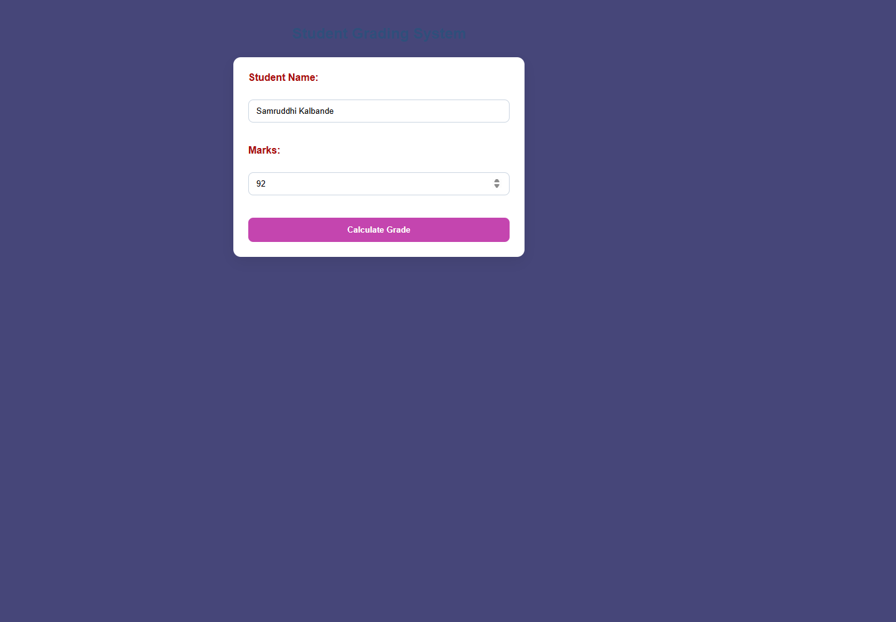
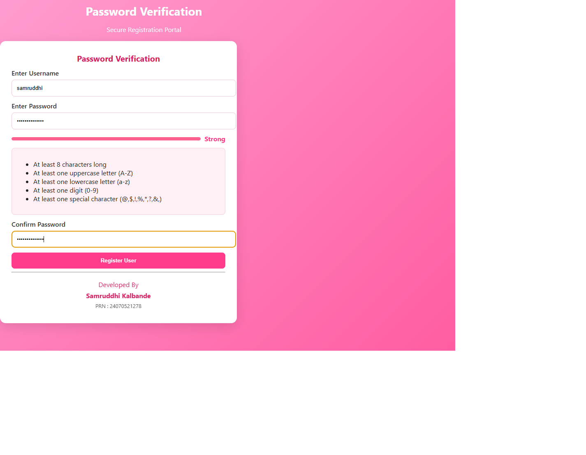

# Experiment No. 3

**Student Name:** Samruddhi Kalbande  
**PRN:** 24070521278  
**File Path:** `pract 3/PRACTICAL/index.html`, `pract 3/PRACTICAL/style.css`

---

## Experiment Title

**Student Grading System & Control Structures**

---

## Software / Tools Required

1. Visual Studio Code / Antigravity IDE
2. Google Chrome (or modern web browser)
3. HTML5
4. CSS3
5. JavaScript (ES6)

---

## Experiment Program Code

### Task 3.a — Student Grading Interface and Marks Assessment Logic

**File:** `pract 3/PRACTICAL/index.html`

The HTML document renders an academic grading interface with inputs for Student Name and Marks, an evaluation action button, and integrated JavaScript logic evaluating numerical performance into letter grades (`A`, `B`, `C`) via `if-else` branching.

```html
<!DOCTYPE html>
<html>
    <head>
        <title>Student Grading System</title>
        <link rel="stylesheet" href="style.css">
    </head>
    <body>
        <h2>Student Grading System</h2>

        <form>
            <label for="name">Student Name:</label><br>
            <input type="text" id="name"><br><br>

            <label for="marks">Marks:</label><br>
            <input type="number" id="marks"><br><br>

            <input type="button" value="Calculate Grade" onclick="gradeSystem()">
        </form>
        <script>
            function gradeSystem() {
                var name = document.getElementById("name").value.trim();
                var marks = document.getElementById("marks").value.trim();

                if (!name || !marks) {
                    alert("Please enter both student name and marks.");
                    return;
                }

                var numericMarks = Number(marks);
                if (isNaN(numericMarks) || numericMarks < 0 || numericMarks > 100) {
                    alert("Please enter a valid marks value between 0 and 100.");
                    return;
                }

                var grade;
                if (numericMarks >= 80) {
                    grade = "A";
                } else if (numericMarks >= 60) {
                    grade = "B";
                } else {
                    grade = "C";
                }

                alert("Student: " + name + "\nGrade: " + grade);
            }
        </script>
    </body>
</html>
```

---

## Output

1. **Input Verification:** Verifies both the Student Name and Marks fields are populated and ensures marks reside within the valid boundary (`0` to `100`).
2. **Conditional Evaluation:** Applies threshold conditions:
   - Marks $\ge 80 \implies$ **Grade A**
   - Marks $60 - 79 \implies$ **Grade B**
   - Marks $< 60 \implies$ **Grade C**
3. **Alert Display:** Presents the student's evaluated grade via an interactive alert dialog.

---

## Screenshot



---

## Case Study

### Case Study — Password Verification & Strength Assessment Portal

**File:** `pract 3/CASE STUDY/index.html`, `pract 3/CASE STUDY/script.js`

A user registration security portal assessing password entropy in real-time across five validation dimensions: length ($\ge 8$), uppercase letters, lowercase letters, digits, and special symbols (`[@$!%*?&,]`).

```javascript
// Password strength and registration logic for Pract 3
const pwd = document.getElementById('password');
const confirmPwd = document.getElementById('confirm');
const strengthBar = document.getElementById('strengthBar');
const strengthText = document.getElementById('strengthText');
const registerBtn = document.getElementById('register');

function scorePassword(s){
  let score = 0;
  if(!s) return 0;
  if(s.length >= 8) score += 1;
  if(/[A-Z]/.test(s)) score += 1;
  if(/[a-z]/.test(s)) score += 1;
  if(/[0-9]/.test(s)) score += 1;
  if(/[@$!%*?&,]/.test(s)) score += 1;
  return score; // 0-5
}

function updateStrength(){
  const s = pwd.value;
  const sc = scorePassword(s);
  const pct = (sc/5)*100;
  strengthBar.style.setProperty('--pct', pct + '%');
  strengthBar.style.background = '#ffe6f0';
  strengthBar.innerHTML = '<div style="height:100%;width:'+pct+'%;background:#ff6090;border-radius:6px"></div>';
  if(sc <= 2) strengthText.textContent = 'Too Weak';
  else if(sc === 3) strengthText.textContent = 'Weak';
  else if(sc === 4) strengthText.textContent = 'Good';
  else strengthText.textContent = 'Strong';
}

pwd.addEventListener('input', updateStrength);

registerBtn.addEventListener('click', function(){
  const p = pwd.value;
  const c = confirmPwd.value;
  if(p !== c){ alert('Passwords do not match'); return; }
  const sc = scorePassword(p);
  if(sc < 3){ alert('Password is too weak'); return; }
  alert('User registered successfully');
});
```

### Case Study Output

1. **Real-time Keystroke Feedback:** Listens to `input` events and dynamically stretches a visual progress bar indicating password strength.
2. **Category Classification:** Classifies password security into four progressive categories: *Too Weak*, *Weak*, *Good*, and *Strong*.
3. **Registration Guard:** Disallows submission if passwords do not match or if the password score falls below the required threshold ($< 3$).

### Case Study Screenshot



---

## Result / Conclusion

Experiment 3 was successfully implemented and verified. The practical and case study validate core control flow structures in JavaScript (`if`, `else if`, `else`), numerical validation using `isNaN()`, string whitespace sanitization via `.trim()`, and real-time event-driven condition checking using regular expressions.
