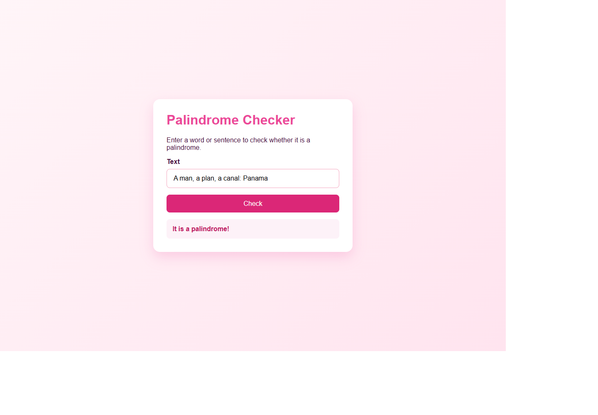
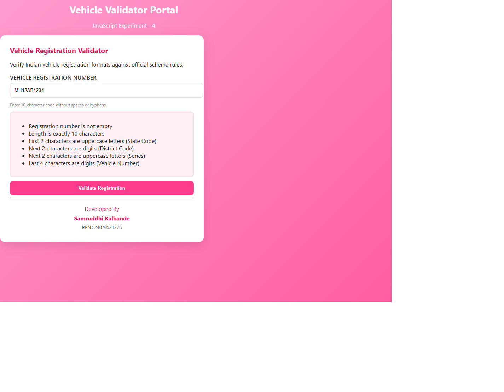

# Experiment No. 4

**Student Name:** Samruddhi Kalbande  
**PRN:** 24070521278  
**File Path:** `pract 4/PRACTICAL/index.html`, `pract 4/PRACTICAL/script.js`

---

## Experiment Title

**Palindrome Checker & Functions in JavaScript**

---

## Software / Tools Required

1. Visual Studio Code / Antigravity IDE
2. Google Chrome (or modern web browser)
3. HTML5
4. CSS3
5. JavaScript (ES6)

---

## Experiment Program Code

### Task 4.a — Palindrome Checker Interface Setup

**File:** `pract 4/PRACTICAL/index.html`

The HTML document structures a clean card-based layout featuring an input field for textual data, an evaluation action button, a dynamic result message container, and student author credentials.

```html
<!DOCTYPE html>
<html lang="en">
<head>
    <meta charset="UTF-8">
    <meta name="viewport" content="width=device-width, initial-scale=1.0">
    <title>Palindrome Checker</title>
    <link rel="stylesheet" href="style.css">
</head>
<body>
    <div class="card">
        <h1>Palindrome Checker</h1>
        <p class="subtitle">Check if a word or phrase reads the same backward as forward.</p>

        <label for="textInput">Enter text</label>
        <input type="text" id="textInput" placeholder="e.g. racecar, madam, 121" autocomplete="off">

        <button id="checkBtn">Check</button>

        <div id="result" class="result" aria-live="polite"></div>

        <div class="author-credits">
            <p><strong>Developed By</strong></p>
            <p>Samruddhi Kalbande</p>
            <p>PRN: 24070521278</p>
        </div>
    </div>
    <script src="script.js"></script>
</body>
</html>
```

---

### Task 4.b — Function Declarations, String Transformations & Event Listeners

**File:** `pract 4/PRACTICAL/script.js`

The JavaScript script encapsulates palindrome detection inside a function featuring `try-catch` exception handling, removes whitespace/non-alphanumeric noise using regex, performs array-based reversal (`.split('').reverse().join('')`), and binds to both mouse `click` and keyboard `keydown` (Enter key) events.

```javascript
const input = document.getElementById('textInput');
const button = document.getElementById('checkBtn');
const resultBox = document.getElementById('result');

function isPalindrome(text) {
  try {
    const cleaned = text.toLowerCase().replace(/[^a-z0-9]/g, '');
    const reversed = cleaned.split('').reverse().join('');
    return cleaned === reversed;
  } catch (error) {
    return false;
  }
}

function showResult(message, isPalindromeText) {
  resultBox.textContent = message;
  resultBox.className = `result ${isPalindromeText ? 'success' : 'error'}`;
}

button.addEventListener('click', () => {
  const text = input.value.trim();

  if (text === '') {
    showResult('Please enter some text.', false);
    return;
  }

  const result = isPalindrome(text);
  showResult(result ? 'It is a palindrome!' : 'It is not a palindrome.', result);
});

input.addEventListener('keydown', (event) => {
  if (event.key === 'Enter') {
    event.preventDefault();
    const text = input.value.trim();

    if (text === '') {
      showResult('Please enter some text.', false);
      return;
    }

    const result = isPalindrome(text);
    showResult(result ? 'It is a palindrome!' : 'It is not a palindrome.', result);
  }
});
```

---

## Output

1. **Input Cleansing:** Case-insensitively strips non-alphanumeric punctuation and spaces before testing.
2. **Reversal & Equivalence:** Uses chaining `.split('').reverse().join('')` to determine symmetric identity.
3. **Dual Event Dispatch:** Users can test phrases by either clicking the **Check** button or pressing the **Enter** key.
4. **Visual Result State:** Updates the result element's class dynamically with `.success` (green) for valid palindromes or `.error` (red) for non-palindromic inputs.

---

## Screenshot



---

## Case Study

### Case Study — Indian Vehicle Registration Validator

**File:** `pract 4/CASE STUDY/index.html`, `pract 4/CASE STUDY/script.js`

A specialized validation portal evaluating license plates against the Indian Motor Vehicles Act standard format (`State(2) + District(2) + Series(2) + UniqueID(4)`, e.g., `MH12AB1234`).

```javascript
// Vehicle registration validator for Pract 4
const regInput = document.getElementById('reg');
const validateBtn = document.getElementById('validate');

function validateRegistration(code){
  if(!code) return {ok:false,msg:'Empty'};
  if(code.length !== 10) return {ok:false,msg:'Length must be 10'};
  const re = /^[A-Z]{2}[0-9]{2}[A-Z]{2}[0-9]{4}$/;
  if(re.test(code)) return {ok:true,msg:'Valid'};
  return {ok:false,msg:'Invalid format'};
}

validateBtn.addEventListener('click', function(){
  const code = (regInput.value || '').trim().toUpperCase();
  const res = validateRegistration(code);
  if(res.ok) alert('Registration is valid');
  else alert('Invalid registration: ' + res.msg);
});
```

### Case Study Output

1. **Length Pre-check:** Enforces an exact 10-character string requirement.
2. **Regex Pattern Matching:** Validates state codes, two-digit district numbers, series letters, and four-digit vehicle identifiers via `/^[A-Z]{2}[0-9]{2}[A-Z]{2}[0-9]{4}$/`.
3. **Structured Object Returns:** The function returns descriptive validation objects `{ ok: boolean, msg: string }` driving modal alerts.

### Case Study Screenshot



---

## Result / Conclusion

Experiment 4 was successfully developed and verified. The practical and case study demonstrate modular functional programming in JavaScript, encompassing function definitions, parameter passing, return structures, `try-catch` blocks, array string reversal pipelines, regular expression validation schemas, and keyboard event dispatching.
