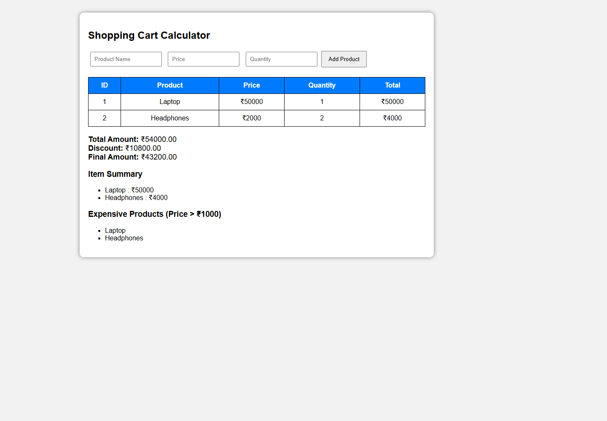

# Experiment No. 5

**Student Name:** Samruddhi Kalbande  
**PRN:** 24070521278  
**File Path:** `pract 5/PRACTICAL/index.html`

---

## Experiment Title

**Shopping Cart Calculator & JavaScript Array Methods**

---

## Software / Tools Required

1. Visual Studio Code / Antigravity IDE
2. Google Chrome (or modern web browser)
3. HTML5
4. CSS3
5. JavaScript (ES6)

---

## Experiment Program Code

### Task 5.a — Shopping Cart Interface and Product Collection

**File:** `pract 5/PRACTICAL/index.html`

The self-contained application renders an input panel (Product Name, Price, Quantity), an action button, an inventory table, order summary statistics, and filter lists.

```html
<div class="container">
    <h2>Shopping Cart Calculator</h2>

    <input type="text" id="name" placeholder="Product Name">
    <input type="number" id="price" placeholder="Price">
    <input type="number" id="qty" placeholder="Quantity">

    <button onclick="addProduct()">Add Product</button>

    <table id="cartTable">
        <tr>
            <th>ID</th>
            <th>Product</th>
            <th>Price</th>
            <th>Quantity</th>
            <th>Total</th>
        </tr>
    </table>

    <div class="result" id="result"></div>

    <h3>Item Summary</h3>
    <ul id="summary"></ul>

    <h3>Expensive Products (Price > ₹1000)</h3>
    <ul id="expensive"></ul>
</div>
```

---

### Task 5.b — Array Manipulation using `push()`, `forEach()`, `reduce()`, `map()`, and `filter()`

**File:** `pract 5/PRACTICAL/index.html`

The application stores products as an array of objects and leverages built-in array methods to calculate totals, compute tiered percentage discounts, generate itemized summaries, and isolate expensive items.

```javascript
// Array to store cart products
let cart = [];

function addProduct() {
    let name = document.getElementById("name").value;
    let price = parseFloat(document.getElementById("price").value);
    let qty = parseInt(document.getElementById("qty").value);

    if (name === "" || isNaN(price) || isNaN(qty)) {
        alert("Please enter all fields");
        return;
    }

    let product = { id: cart.length + 1, name: name, price: price, quantity: qty };
    cart.push(product);
    displayCart();

    document.getElementById("name").value = "";
    document.getElementById("price").value = "";
    document.getElementById("qty").value = "";
}

function displayCart() {
    let table = document.getElementById("cartTable");
    table.innerHTML = `<tr><th>ID</th><th>Product</th><th>Price</th><th>Quantity</th><th>Total</th></tr>`;

    // forEach() - Render rows
    cart.forEach(function(item) {
        table.innerHTML += `<tr><td>${item.id}</td><td>${item.name}</td><td>₹${item.price}</td><td>${item.quantity}</td><td>₹${item.price * item.quantity}</td></tr>`;
    });

    // reduce() - Aggregate total bill
    let total = cart.reduce(function(sum, item) {
        return sum + (item.price * item.quantity);
    }, 0);

    // Discount Tiers
    let discount = 0;
    if (total >= 50000) discount = total * 0.20;
    else if (total >= 20000) discount = total * 0.10;
    else if (total >= 5000) discount = total * 0.05;

    let finalAmount = total - discount;
    document.getElementById("result").innerHTML = `
        <b>Total Amount:</b> ₹${total.toFixed(2)}<br>
        <b>Discount:</b> ₹${discount.toFixed(2)}<br>
        <b>Final Amount:</b> ₹${finalAmount.toFixed(2)}`;

    // map() - Item summary
    let summary = document.getElementById("summary");
    summary.innerHTML = "";
    cart.map(function(item) {
        summary.innerHTML += `<li>${item.name} : ₹${item.price * item.quantity}</li>`;
    });

    // filter() - Expensive items (> ₹1000)
    let expensive = document.getElementById("expensive");
    expensive.innerHTML = "";
    let exp = cart.filter(function(item) {
        return item.price > 1000;
    });
    exp.forEach(function(item) {
        expensive.innerHTML += `<li>${item.name}</li>`;
    });
}
```

---

## Output

1. **Item Append:** Adds dynamic items to the underlying array using `cart.push()`.
2. **Table Iteration:** Employs `forEach()` to dynamically render and populate table rows.
3. **Cart Aggregation:** `reduce()` computes the cumulative gross total across all rows.
4. **Automated Discounts:** Determines applicable tier ($5\%$ for $\ge ₹5,000$, $10\%$ for $\ge ₹20,000$, $20\%$ for $\ge ₹50,000$).
5. **Collection Mapping & Filtering:** `map()` projects line summaries, and `filter()` extracts items with unit price $> ₹1,000$.

---

## Screenshot



---

## Case Study

### Case Study — Student Marks Management & Statistical Analyzer

**File:** `pract 5/CASE STUDY/index.html`, `pract 5/CASE STUDY/script.js`

A statistical dashboard managing student marks records inside an array, computing class size, assigning categorical performance ratings, and extracting minimum and maximum grades using `Math.min`, `Math.max`, and `.find()`.

```javascript
const students = [];

studentForm.addEventListener("submit", (event) => {
	event.preventDefault();
	const name = document.getElementById("studentName").value.trim();
	const marks = Number(document.getElementById("studentMarks").value);

	if (!name || !Number.isInteger(marks) || marks < 0 || marks > 100) {
		message.textContent = "Enter a student name and marks between 0 and 100.";
		return;
	}

	students.push({ name, marks });
	renderStudents();
	updateRange();
});

function renderStudents() {
	const table = document.getElementById("studentTable");
	table.innerHTML = "";
	students.forEach((student, index) => {
		const row = document.createElement("tr");
		const performance = student.marks >= 75 ? "Excellent" : student.marks >= 50 ? "Pass" : "Needs support";
		row.innerHTML = `<td class="index">${String(index + 1).padStart(2, "0")}</td><td>${student.name}</td><td class="marks">${student.marks}</td><td><span class="performance">${performance}</span></td>`;
		table.appendChild(row);
	});
}

function updateRange() {
	if (students.length === 0) return;
	const marksList = students.map((student) => student.marks);
	const minimum = Math.min(...marksList);
	const maximum = Math.max(...marksList);
	const minimumStudent = students.find((student) => student.marks === minimum);
	const maximumStudent = students.find((student) => student.marks === maximum);

	document.getElementById("minimumMarks").textContent = minimum;
	document.getElementById("minimumStudent").textContent = minimumStudent.name;
	document.getElementById("maximumMarks").textContent = maximum;
	document.getElementById("maximumStudent").textContent = maximumStudent.name;
}
```

### Case Study Output

1. **Tabular Rendering with Badges:** Formats records into rows with zero-padded IDs (`01`, `02`) and performance badges (*Excellent*, *Pass*, *Needs support*).
2. **Statistical Metric Extraction:** Transforms student objects via `.map()` into a numeric array, evaluating extremes through `Math.min(...)` and `Math.max(...)`.
3. **Record Lookup:** Utilizes `.find()` to locate and display student names associated with lowest and highest marks.

### Case Study Screenshot


---

## Result / Conclusion

Experiment 5 was successfully implemented and verified. The practical and case study demonstrate real-world collection processing using JavaScript arrays, covering item insertion (`push`), iteration (`forEach`), data transformation (`map`), subset condition filtering (`filter`), cumulative reduction (`reduce`), spread operators (`...`), and search algorithms (`find`).
