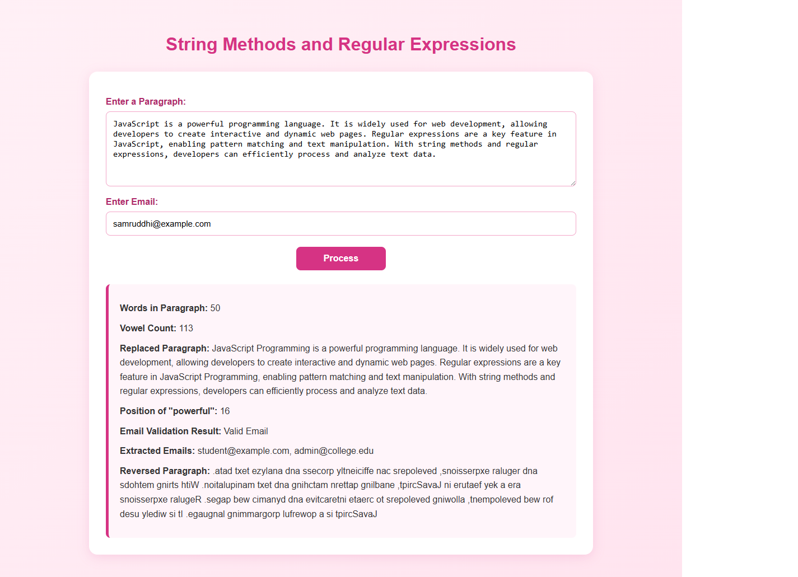

# Experiment No. 6

**Student Name:** Samruddhi Kalbande  
**PRN:** 24070521278  
**File Path:** `pract 6/PRACTICAL/index.html`, `pract 6/PRACTICAL/script.js`

---

## Experiment Title

**String Methods & Regular Expressions (RegEx) Text Processing Tool**

---

## Software / Tools Required

1. Visual Studio Code / Antigravity IDE
2. Google Chrome (or modern web browser)
3. HTML5
4. CSS3
5. JavaScript (ES6)

---

## Experiment Program Code

### Task 6.a — String Processing & Regular Expression Analysis Interface

**File:** `pract 6/PRACTICAL/index.html`

The HTML document creates an interactive text workbench with textarea inputs for paragraph analysis, single-line email verification inputs, a process button, and structured output display containers.

```html
<!DOCTYPE html>
<html>
<head>
    <title>Practical 6 - String & Regex</title>
    <link rel="stylesheet" href="style.css">
</head>
<body>
<div class="container">
    <h2>String Methods and Regular Expressions</h2>

    <label>Enter Paragraph:</label>
    <textarea id="paragraph" rows="5" placeholder="Enter paragraph here..."></textarea>

    <label>Enter Email to Validate:</label>
    <input type="text" id="email" placeholder="example@email.com">

    <button onclick="processString()">Process</button>

    <div class="output" id="output"></div>
</div>
<script src="script.js"></script>
</body>
</html>
```

---

### Task 6.b — String Method Pipeline & Regex Pattern Matching Logic

**File:** `pract 6/PRACTICAL/script.js`

The JavaScript script analyzes text using built-in string methods (`split`, `indexOf`, `replace`, array reversal) and executes regular expressions with flags (`/pattern/gi`) for vowel tallying, email RFC compliance verification, and global address token extraction.

```javascript
function processString() {
    let paragraph = document.getElementById("paragraph").value.trim();
    let email = document.getElementById("email").value.trim();

    // Word count via whitespace tokenization
    let words = paragraph.split(/\s+/);

    // Vowel count via regex matching
    let vowels = paragraph.match(/[aeiou]/gi);
    let vowelCount = vowels ? vowels.length : 0;

    // Substring replacement
    let replacedParagraph = paragraph.replace(
        /JavaScript/gi,
        "JavaScript Programming"
    );

    // Index lookup
    let searchWord = "powerful";
    let position = paragraph.indexOf(searchWord);

    // Email validation
    let emailPattern = /^[a-zA-Z0-9._%+-]+@[a-zA-Z0-9.-]+\.[a-zA-Z]{2,}$/;
    let emailResult = emailPattern.test(email) ? "Valid Email" : "Invalid Email";

    // Global extraction
    let emailText = "For queries, contact student@example.com or admin@college.edu";
    let extractedEmails = emailText.match(/[a-zA-Z0-9._%+-]+@[a-zA-Z0-9.-]+\.[a-zA-Z]{2,}/g);

    // String reversal
    let reversedParagraph = paragraph.split("").reverse().join("");

    document.getElementById("output").innerHTML = `
        <p><b>Words in Paragraph:</b> ${words.length}</p>
        <p><b>Vowel Count:</b> ${vowelCount}</p>
        <p><b>Replaced Paragraph:</b> ${replacedParagraph}</p>
        <p><b>Position of "${searchWord}":</b> ${position !== -1 ? position : "Not Found"}</p>
        <p><b>Email Validation Result:</b> ${emailResult}</p>
        <p><b>Extracted Emails:</b> ${extractedEmails ? extractedEmails.join(", ") : "None"}</p>
        <p><b>Reversed Paragraph:</b> ${reversedParagraph}</p>`;
}
```

---

## Output

1. **Word & Vowel Computation:** Splits the paragraph across whitespace boundaries to count words and executes regex `/[aeiou]/gi` to calculate vowel volume.
2. **Text Search & Transformation:** Locates character offsets using `indexOf()` and executes case-insensitive string substitutions.
3. **Pattern Verification & Parsing:** Validates email input integrity with `.test()` and extracts all email addresses matching the global RFC expression.

---

## Screenshot



---

## Case Study

### Case Study 1 — User Authentication & Registration Portal

**File:** `pract 6/CASE STUDY 1/index.html`, `pract 6/CASE STUDY 1/script.js`

An authentication system featuring sign-in and sign-up interfaces with real-time regular expression checks for email syntax, minimum password complexity constraints, and credential verification against simulated accounts.

```javascript
const emailRegex = /^[a-zA-Z0-9._%+-]+@[a-zA-Z0-9.-]+\.[a-zA-Z]{2,}$/;

loginForm.addEventListener("submit", function(event) {
    event.preventDefault();
    const email = document.getElementById("email").value.trim();
    const password = document.getElementById("password").value.trim();
    const message = document.getElementById("loginMessage");

    if (!emailRegex.test(email)) {
        message.textContent = "Please enter a valid email address.";
        message.style.color = "#d62828";
        return;
    }
    if (password.length < 6) {
        message.textContent = "Password must contain at least 6 characters.";
        message.style.color = "#d62828";
        return;
    }
    if (email === "user@example.com" && password === "Password@123") {
        message.textContent = "Login successful!";
        message.style.color = "#1769d1";
    } else {
        message.textContent = "Invalid email or password.";
        message.style.color = "#d62828";
    }
});
```

### Case Study 1 Screenshot


---

### Case Study 2 — Student Information Text Extractor

**File:** `pract 6/CASE STUDY 2/index.html`, `pract 6/CASE STUDY 2/script.js`

A text parsing engine using regular expression capture groups to parse unstructured paragraph text and extract Name, Roll Number, 10-digit Phone Number, and Email Address.

```javascript
function processText() {
    let text = document.getElementById("inputText").value;

    let nameMatch = text.match(/student\s+name\s+is\s+([A-Za-z ]+)/i);
    let rollMatch = text.match(/roll\s+number\s+is\s+(\d+)/i);
    let phoneMatch = text.match(/phone\s+number\s+is\s+(\d{10})/i);
    let emailMatch = text.match(/email\s+id\s+is\s+([A-Za-z0-9._%+-]+@[A-Za-z0-9.-]+\.[A-Za-z]{2,})/i);

    let name = nameMatch ? nameMatch[1].trim() : "Not Found";
    let roll = rollMatch ? rollMatch[1].trim() : "Not Found";
    let phone = phoneMatch ? phoneMatch[1].trim() : "Not Found";
    let email = emailMatch ? emailMatch[1].trim() : "Not Found";

    let emailRegex = /^[A-Za-z0-9._%+-]+@[A-Za-z0-9.-]+\.[A-Za-z]{2,}$/;
    let phoneRegex = /^\d{10}$/;

    let emailStatus = emailRegex.test(email) ? "Valid" : "Invalid";
    let phoneStatus = phoneRegex.test(phone) ? "Valid" : "Invalid";
}
```

### Case Study 2 Screenshot


---

## Result / Conclusion

Experiment 6 was successfully implemented and verified. The practical and dual case studies demonstrate the utility of JavaScript string methods and regular expressions for text tokenization, case-insensitive string substitutions, input validation, authentication security, and information extraction using capture groups.
