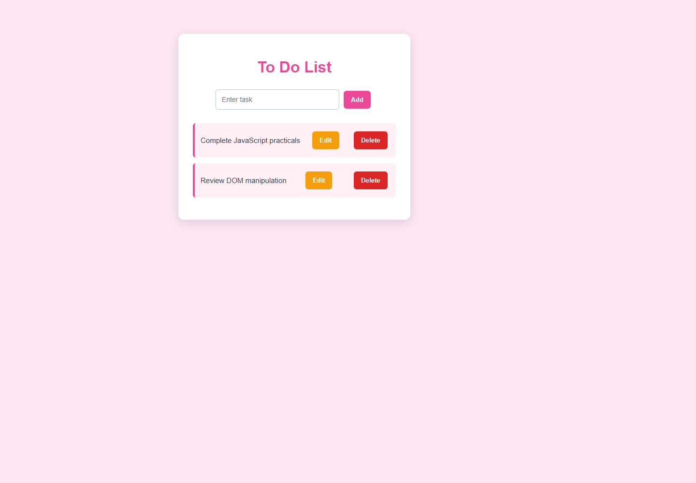

# Experiment No. 7

**Student Name:** Samruddhi Kalbande  
**PRN:** 24070521278  
**File Path:** `pract 7/PRACTICAL/index.html`, `pract 7/PRACTICAL/script.js`

---

## Experiment Title

**Dynamic Interactive To-Do List Application & Event-Driven Form**

---

## Software / Tools Required

1. Visual Studio Code / Antigravity IDE
2. Google Chrome (or modern web browser)
3. HTML5
4. CSS3
5. JavaScript (ES6)

---

## Experiment Program Code

### Task 7.a — Dynamic DOM Manipulation To-Do List

**File:** `pract 7/PRACTICAL/index.html`

The HTML interface provides an input bar, an action button, and an empty list container (`#taskList`) that is populated and modified dynamically through JavaScript DOM methods.

```html
<!DOCTYPE html>
<html>
<head>
    <title>To Do List</title>
    <link rel="stylesheet" href="style.css">
</head>
<body>
    <div class="todo-container">
        <h2>To-Do List</h2>
        <div class="input-area">
            <input type="text" id="taskInput" placeholder="Add a new task...">
            <button id="addBtn">Add</button>
        </div>
        <ul id="taskList"></ul>
        <div class="author-credits">
            <p><strong>Developed By</strong></p>
            <p>Samruddhi Kalbande</p>
            <p>PRN: 24070521278</p>
        </div>
    </div>
    <script src="script.js"></script>
</body>
</html>
```

---

### Task 7.b — DOM Node Lifecycle: Creation, In-place Replacement, and Removal

**File:** `pract 7/PRACTICAL/script.js`

The JavaScript script constructs list items programmatically using `document.createElement()`, implements an in-place editing toggle using `li.replaceChild()` to swap between `<span>` text and `<input>` controls, and cleans up elements using `li.remove()`.

```javascript
let input = document.getElementById("taskInput");
let addBtn = document.getElementById("addBtn");
let taskList = document.getElementById("taskList");

addBtn.addEventListener("click", function() {
    let task = input.value;
    if (task == "") {
        alert("Enter a task");
        return;
    }

    let li = document.createElement("li");
    let span = document.createElement("span");
    let editBtn = document.createElement("button");
    let deleteBtn = document.createElement("button");

    span.innerText = task;
    editBtn.innerText = "Edit";
    editBtn.className = "edit";
    deleteBtn.innerText = "Delete";
    deleteBtn.className = "delete";

    editBtn.addEventListener("click", function() {
        if (editBtn.innerText === "Edit") {
            let input = document.createElement("input");
            input.type = "text";
            input.value = span.innerText;
            li.replaceChild(input, span);
            editBtn.innerText = "Save";
            input.focus();
        } else {
            let input = li.querySelector("input");
            let newTask = input.value;
            if (newTask !== "") {
                span.innerText = newTask;
                li.replaceChild(span, input);
                editBtn.innerText = "Edit";
            } else {
                alert("Task cannot be empty");
            }
        }
    });

    deleteBtn.addEventListener("click", function() {
        li.remove();
    });

    li.appendChild(span);
    li.appendChild(editBtn);
    li.appendChild(deleteBtn);
    taskList.appendChild(li);

    input.value = "";
});
```

---

## Output

1. **Task Insertion:** Typing a task and clicking **Add** constructs a new `<li>` element containing task text and two styled operational buttons (**Edit** and **Delete**).
2. **Task Editing:** Clicking **Edit** swaps the display `<span>` for an active `<input>` field using `replaceChild()`, switching button state to **Save** to confirm updates.
3. **Task Deletion:** Clicking **Delete** executes `li.remove()`, instantly purging the item from the live DOM tree.

---

## Screenshot



---

## Case Study

### Case Study — Event-Driven Registration Form with Real-Time Validation

**File:** `pract 7/CASE STUDY/index.html`, `pract 7/CASE STUDY/script.js`

A registration portal demonstrating dynamic select option generation (`day`, `year`), multi-event listening (`focus`, `blur`, `change`, `submit`), accessibility attribute binding (`aria-invalid`), and real-time password confirmation.

```javascript
// Dynamic Day and Year option generation
for (let number = 1; number <= 31; number += 1) {
    day.insertAdjacentHTML("beforeend", `<option value="${number}">${number}</option>`);
}

for (let value = new Date().getFullYear(); value >= 1900; value -= 1) {
    year.insertAdjacentHTML("beforeend", `<option value="${value}">${value}</option>`);
}

function validateField(field) {
    clearError(field);

    if (field.type === "checkbox" && !field.checked) {
        return showError(field, "You must agree before registering.");
    }
    if (!field.value.trim() && field.type !== "checkbox") {
        return showError(field, "This field is required.");
    }
    if (!field.checkValidity()) {
        if (field.type === "email") return showError(field, "Enter a valid email address.");
        if (field.type === "url") return showError(field, "Enter a valid website URL.");
        if (field === password) return showError(field, "Password must contain at least 8 characters.");
    }
    if (field === rePassword && field.value !== password.value) {
        return showError(field, "Passwords do not match.");
    }
    return true;
}

// Multi-event listeners for real-time validation feedback
form.querySelectorAll("input, select").forEach((field) => {
    field.addEventListener("focus", () => field.classList.add("focused"));
    field.addEventListener("blur", () => {
        field.classList.remove("focused");
        validateField(field);
    });
    field.addEventListener("change", () => validateField(field));
});
```

### Case Study Screenshot


---

## Result / Conclusion

Experiment 7 was successfully implemented and verified. The practical and case study demonstrate the power of JavaScript DOM manipulation and event-driven architecture, enabling dynamic element creation, node swapping via `replaceChild()`, DOM tree pruning with `.remove()`, programmatic option population using `insertAdjacentHTML()`, and accessible real-time form validation.
