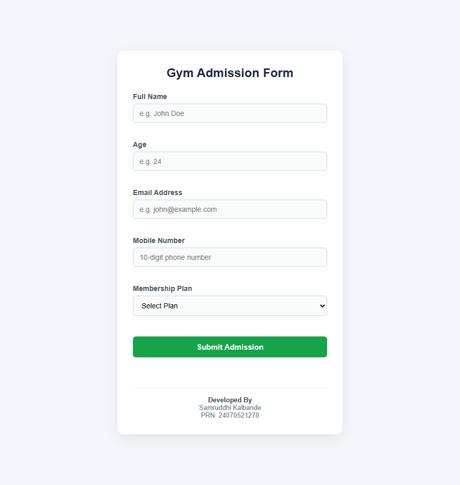

# Experiment No. 8

**Student Name:** Samruddhi Kalbande  
**PRN:** 24070521278  
**File Path:** `pract 8/PRACTICAL/index.html`, `pract 8/PRACTICAL/script.js`

---

## Experiment Title

**Gym Admission Form Validation & Multi-Event Handling in JavaScript**

---

## Software / Tools Required

1. Visual Studio Code / Antigravity IDE
2. Google Chrome / Microsoft Edge (or modern web browser)
3. HTML5
4. CSS3
5. JavaScript (ES6)

---

## Experiment Program Code

### Task 8.a — Gym Admission Form Structure

**File:** `pract 8/PRACTICAL/index.html`

The HTML interface constructs a structured gym membership admission form equipped with dedicated input controls, customized error display nodes (`<span class="error">`), a selection dropdown for subscription duration, an accessible submit trigger, and a dynamic feedback element (`#result`).

```html
<!DOCTYPE html>
<html lang="en">
<head>
    <meta charset="UTF-8">
    <meta name="viewport" content="width=device-width, initial-scale=1.0">
    <title>Gym Admission Form - Experiment 8</title>
    <link rel="stylesheet" href="style.css">
</head>
<body>

    <div class="container">
        <h2>Gym Admission Form</h2>

        <form id="gymForm" novalidate>
            <label for="name">Full Name</label>
            <input type="text" id="name" placeholder="e.g. John Doe">
            <span id="nameError" class="error"></span>

            <label for="age">Age</label>
            <input type="number" id="age" placeholder="e.g. 24">
            <span id="ageError" class="error"></span>

            <label for="email">Email Address</label>
            <input type="email" id="email" placeholder="e.g. john@example.com">
            <span id="emailError" class="error"></span>

            <label for="mobile">Mobile Number</label>
            <input type="text" id="mobile" placeholder="10-digit phone number">
            <span id="mobileError" class="error"></span>

            <label for="plan">Membership Plan</label>
            <select id="plan">
                <option value="">Select Plan</option>
                <option value="Monthly">Monthly</option>
                <option value="Quarterly">Quarterly</option>
                <option value="Yearly">Yearly</option>
            </select>
            <span id="planError" class="error"></span>

            <button type="submit">Submit Admission</button>

            <p id="result" class="success"></p>
        </form>

        <div class="author-credits">
            <p><strong>Developed By</strong></p>
            <p>Samruddhi Kalbande</p>
            <p>PRN: 24070521278</p>
        </div>
    </div>

    <script src="script.js"></script>
</body>
</html>
```

---

### Task 8.b — Multi-Event Field Validation and Submission Logic

**File:** `pract 8/PRACTICAL/script.js`

The JavaScript controller wires up tailored event listeners across input elements (`input` for instant feedback, `blur` for loss-of-focus validation, `change` for select elements, and `submit` for overarching validation verification).

```javascript
// Name Validation (input event)
document.getElementById("name").addEventListener("input", function () {
    let name = this.value.trim();

    if (name === "") {
        document.getElementById("nameError").innerHTML = "Name is required.";
    } else if (!/^[A-Za-z ]+$/.test(name)) {
        document.getElementById("nameError").innerHTML = "Only letters allowed.";
    } else {
        document.getElementById("nameError").innerHTML = "";
    }
});

// Age Validation (blur event)
document.getElementById("age").addEventListener("blur", function () {
    let age = this.value.trim();

    if (age === "") {
        document.getElementById("ageError").innerHTML = "Age is required.";
    } else if (Number(age) < 16 || Number(age) > 60) {
        document.getElementById("ageError").innerHTML = "Age must be between 16 and 60.";
    } else {
        document.getElementById("ageError").innerHTML = "";
    }
});

// Email Validation (input event)
document.getElementById("email").addEventListener("input", function () {
    let email = this.value.trim();
    let pattern = /^[^\s@]+@[^\s@]+\.[^\s@]+$/;

    if (email === "") {
        document.getElementById("emailError").innerHTML = "Email is required.";
    } else if (!pattern.test(email)) {
        document.getElementById("emailError").innerHTML = "Invalid email format.";
    } else {
        document.getElementById("emailError").innerHTML = "";
    }
});

// Mobile Validation (input event)
document.getElementById("mobile").addEventListener("input", function () {
    let mobile = this.value.trim();

    if (mobile === "") {
        document.getElementById("mobileError").innerHTML = "Mobile number is required.";
    } else if (!/^\d{10}$/.test(mobile)) {
        document.getElementById("mobileError").innerHTML = "Enter a valid 10-digit mobile number.";
    } else {
        document.getElementById("mobileError").innerHTML = "";
    }
});

// Membership Validation (change event)
document.getElementById("plan").addEventListener("change", function () {
    if (this.value === "") {
        document.getElementById("planError").innerHTML = "Please select a plan.";
    } else {
        document.getElementById("planError").innerHTML = "";
    }
});

// Form Submission (submit event)
document.getElementById("gymForm").addEventListener("submit", function (e) {
    e.preventDefault();

    let name = document.getElementById("name").value.trim();
    let age = document.getElementById("age").value.trim();
    let email = document.getElementById("email").value.trim();
    let mobile = document.getElementById("mobile").value.trim();
    let plan = document.getElementById("plan").value;

    let isValid = true;

    // Validate Name
    if (name === "") {
        document.getElementById("nameError").innerHTML = "Name is required.";
        isValid = false;
    } else if (!/^[A-Za-z ]+$/.test(name)) {
        document.getElementById("nameError").innerHTML = "Only letters allowed.";
        isValid = false;
    } else {
        document.getElementById("nameError").innerHTML = "";
    }

    // Validate Age
    if (age === "") {
        document.getElementById("ageError").innerHTML = "Age is required.";
        isValid = false;
    } else if (Number(age) < 16 || Number(age) > 60) {
        document.getElementById("ageError").innerHTML = "Age must be between 16 and 60.";
        isValid = false;
    } else {
        document.getElementById("ageError").innerHTML = "";
    }

    // Validate Email
    let emailPattern = /^[^\s@]+@[^\s@]+\.[^\s@]+$/;
    if (email === "") {
        document.getElementById("emailError").innerHTML = "Email is required.";
        isValid = false;
    } else if (!emailPattern.test(email)) {
        document.getElementById("emailError").innerHTML = "Invalid email format.";
        isValid = false;
    } else {
        document.getElementById("emailError").innerHTML = "";
    }

    // Validate Mobile
    if (mobile === "") {
        document.getElementById("mobileError").innerHTML = "Mobile number is required.";
        isValid = false;
    } else if (!/^\d{10}$/.test(mobile)) {
        document.getElementById("mobileError").innerHTML = "Enter a valid 10-digit mobile number.";
        isValid = false;
    } else {
        document.getElementById("mobileError").innerHTML = "";
    }

    // Validate Plan
    if (plan === "") {
        document.getElementById("planError").innerHTML = "Please select a plan.";
        isValid = false;
    } else {
        document.getElementById("planError").innerHTML = "";
    }

    if (isValid) {
        document.getElementById("result").innerHTML = "Gym Admission Successful! Welcome aboard.";
    } else {
        document.getElementById("result").innerHTML = "";
    }
});
```

---

## Event-Driven Validation Architecture

| Form Field | Trigger Event | Validation Criteria | Error Feedback Message |
|:---|:---:|:---|:---|
| **Full Name** | `input` | Alphabetic characters and spaces only (`/^[A-Za-z ]+$/`) | "Only letters allowed." / "Name is required." |
| **Age** | `blur` | Numeric range between 16 and 60 years inclusive | "Age must be between 16 and 60." / "Age is required." |
| **Email Address** | `input` | Standard RFC-compliant email pattern (`/^[^\s@]+@[^\s@]+\.[^\s@]+$/`) | "Invalid email format." / "Email is required." |
| **Mobile Number** | `input` | Exact 10-digit numeric format (`/^\d{10}$/`) | "Enter a valid 10-digit mobile number." / "Mobile number is required." |
| **Membership Plan** | `change` | Non-empty selection from dropdown | "Please select a plan." |
| **Complete Form** | `submit` | All fields must pass validation criteria | Success banner displayed upon complete validation pass |

---

## Output

1. **Keystroke-Level Feedback:** Instant visual error feedback occurs as the user types invalid characters into the name, email, or mobile inputs.
2. **Focus-Loss Range Check:** Leaving the age field triggers validation on `blur`, verifying the user meets fitness age requirements (16–60).
3. **Selection Verification:** Modifying the membership dropdown validates selection immediately via the `change` event.
4. **Form Interception & Submission:** Clicking **Submit Admission** cancels the default HTTP postback via `e.preventDefault()`, runs full verification across all controls, and prints `"Gym Admission Successful! Welcome aboard."` upon success.

---

## Screenshot



---

## Case Study 1

### Case Study 1 — Tabular Gym Admission Form with Multi-Field Validation

**File:** `pract 8/CASE STUDY/index.html`, `pract 8/CASE STUDY/script.js`

A tabular data entry application showcasing form fields embedded within semantic HTML tables (`<table>`, `<tr>`, `<td>`), handling radio buttons (`name="sex"`), select dropdowns (`#eyeColor`), checkboxes (`#height`, `#weight`), and multiline text areas (`#ability`).

```javascript
form.addEventListener("submit", function (e) {
    e.preventDefault();

    let valid = true;
    let name = nameInput.value.trim();
    let selectedSex = document.querySelector('input[name="sex"]:checked');

    if (name === "" || !/^[A-Za-z ]+$/.test(name)) {
        document.getElementById("nameError").innerHTML = "Please enter a valid name.";
        valid = false;
    } else {
        document.getElementById("nameError").innerHTML = "";
    }

    if (!selectedSex) {
        document.getElementById("sexError").innerHTML = "Please select your sex.";
        valid = false;
    } else {
        document.getElementById("sexError").innerHTML = "";
    }

    if (eyeColor.value === "") {
        document.getElementById("eyeError").innerHTML = "Please select an eye color.";
        valid = false;
    } else {
        document.getElementById("eyeError").innerHTML = "";
    }

    if (ability.value.trim() === "") {
        document.getElementById("abilityError").innerHTML = "Please describe your athletic ability.";
        valid = false;
    } else {
        document.getElementById("abilityError").innerHTML = "";
    }

    if (valid) {
        document.getElementById("result").innerHTML = "Gym Admission Successful!";
    } else {
        document.getElementById("result").innerHTML = "";
        alert("Please correct the errors before submitting.");
    }
});
```

### Case Study 1 Screenshot


---

## Case Study 2

### Case Study 2 — E-Commerce Product Filter with Regex Search & Category Filtering

**File:** `pract 8/CASE STUDY PRACTICE/index.html`, `pract 8/CASE STUDY PRACTICE/script.js`

A high-performance e-commerce catalog featuring real-time product filtering, dynamic card rendering, regular expression query sanitization (`/^[A-Za-z ]*$/`), multi-criteria filtering across category and keyword, and dynamic filter resets.

```javascript
function filterProducts() {
    if (validateSearch() === false) {
        return;
    }

    const searchText = searchBox.value.toLowerCase();
    const selectedCategory = category.value;

    const filteredProducts = products.filter(function(product) {
        const productName = product.name.toLowerCase();
        const nameMatch = productName.includes(searchText);
        const categoryMatch =
            selectedCategory === "All" ||
            product.category === selectedCategory;

        return nameMatch && categoryMatch;
    });

    displayProducts(filteredProducts);
}

searchBox.addEventListener("input", function() {
    validateSearch();
    filterProducts();
});

category.addEventListener("change", function() {
    filterProducts();
});

clearBtn.addEventListener("click", function() {
    clearFilters();
});
```

### Case Study 2 Screenshot


---

## Result / Conclusion

Experiment 8 was successfully executed, verified, and documented. The experiment demonstrated the complete spectrum of JavaScript form validation strategies:
1. Real-time client-side feedback utilizing granular event listeners (`input`, `blur`, `change`).
2. Regular expression validation algorithms verifying alphabetic constraints, RFC email structures, and telephone numbering plans.
3. Event object interception (`e.preventDefault()`) preventing uncontrolled HTTP submissions.
4. Tabular multi-input validation and dynamic catalog filtering using higher-order array filters and regex-backed user query sanitization.
